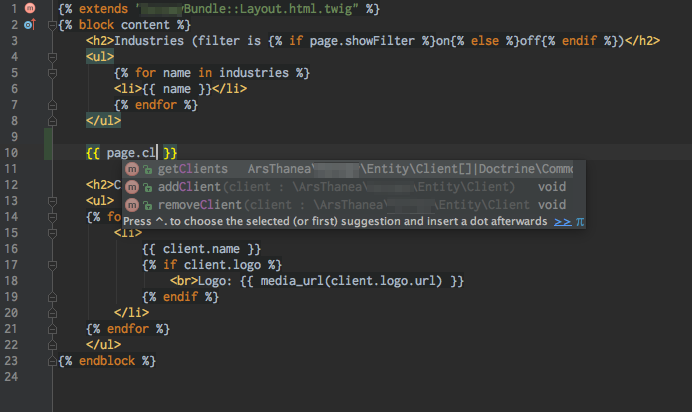

# Page Conventions

When making a page or pagepart, extend the KunstmaanExtra entities to automatically follow the naming conventions
and enable some out of the box functionality, including:

 * Automatic `FormType` choosing
 * Automatic template selection, including admin vs default view
 * Automatic Controller actions executed before page is loaded.
 
The KunstmaanExtra entities are located in:

 * `\ArsThanea\KunstmaanExtraBundle\Page\KunstmaanExtraPage`
 * `\ArsThanea\KunstmaanExtraBundle\Page\KunstmaanExtraPagePart`
 
## Naming conventions

Given a Page `AcmeBundle\Entity\Pages\FooBarPage`:

  * You don’t need a custom `FormType` for a page, but if you need one, define it in `AcmeBundle\Form\Pages\FooBarAdminType` and it will be used automatically
  * Your page default view should be located in `AcmeBundleDirectory/Resources/views/Pages/FooBar/FooBarPage.html.twig`
  * You don’t need a controller to display a page, but if you define `AcmeBundle\Controller\Pages\FooBarController` 
    implementing `PageControllerInterface` the service action will be executed before page is displayed. They are not
    really controllers, since they do not get the `Request` object nor do they return a `Response` (an array is expected
    instead), so beware of that. The only thing this class can do is to add some variables to twig context.
    
Given a PagePart `AcmeBundle\Entity\PageParts\EglebeglePagePart`:

  * Your views should be located in `AcmeBundleDirectory/Resources/views/PageParts/Eglebegle` and should be named:
     * `EglebeglePagePart.default.html.twig` for your page display
     * and `EglebeglePagePart.admin.html.twig` for admin panel. You may include the former file here if you don’t
       need a different admin representation, but from my experience that’s usually not the case
  * A `FormType` is required for your page part and it should be defined in `AcmeBundle\Form\PageParts\EglebegleAdminType`


*Hint*: If you’re unsure about the exact names (for instance if using subdirectories) just run the site without 
generating them and there should be an exception telling you that some class or template is expected but missing.

You may ofcourse override those using standard mechanisms such as `getDefaultView`, `getDefaultAdminType`, etc.

## Page Context

When using the `KunstmaanExtraPage` a page context is generated automatically. This means that some twig variables
are prepared for your page automatically. This is best for functionality common across all or most of the pages,
and the main goal is to unclutter the templates and make your code more DRY.

For example, you’d like a page to have a common header with an image. Let’s create a `HeaderImageProvider`:

```php
<?php

interface HasHeaderImageInterface 
{
    public function getHeaderImageUrl();
}

class HeaderImageProvider implements PageContextProviderInterface
{
    /**
    * @param HasNodeInterface $page
    * @param array            $context
    *
    * @return mixed
    */
    public function getContextValue(HasNodeInterface $page, array $context) 
    {
        if ($page instanceof HasHeaderImageInterface) {
            return $page->getHeaderImageUrl();
        }
        
        return null;
    }
    
    /**
    * @return string|array — one or multiple keys
    */
    public function getContextName() 
    {
        return 'headerImage';
    }
}
```

And register this class in the container using `page_context_provider` tag:

```yaml
# services.yml
services: 
   acme.foo_bar.header_image_provider:
      class: 'HeaderImageProvider'
      public: false
      tags:
        - name: page_context_provider
          priority: 100     # default is 1024, higher priorities are executed first
```

Now you’ll have the `{{ headerImage }}` variable defined in your page default view.

## PHPStorm template variables autocompletion

[PHPStrorm Symfony2 Plugin](https://plugins.jetbrains.com/plugin/7219) is required.



There are two ways to set it up.

### 1. For Pages and PageParts

This will complete `page` variable for Pages and `resource` for PageParts. Configure it for your dev environment
(there is no reason for it to be enabled in other envs):

```yaml
# app/config/config_dev.yml

kunstmaan_extra:
    generate_controller: "%kernel.root_dir%/KunstmaanExtraController.php"
    
```

And add this file to gitignore:

```
# .gitignore
app/KunstmaanExtraController.php
```

After the cache is build (`cache:clear`, `cache:warmup`) and this file is indexed by PHPStrom you should have the
autocompletion working. 
You need to [configure your pageparts via the symfony configuration](https://github.com/Kunstmaan/KunstmaanBundlesCMS/pull/1109)
for this to work. You probably need to 
[configure your pages via symfony as well](https://github.com/Kunstmaan/KunstmaanBundlesCMS/pull/538).

### 2. For custom page controllers

If you’re using the automatic page controllers (see above) they add some variables to the context by returning an array.
PHPStorm won’t recognize them by default, but if instead of implementing `PageControllerInterface` you’ll extend
the `AbstractNonRenderingController` and use `render` method to return the data — it will. See example below:

```php

class FooBarController extends \ArsThanea\KunstmaanExtraBundle\Page\PageController\AbstractNonRenderingController {
    public function serviceAction(HasNodeInterface $page, array $context) {
        // ...
        
        return $this->render('@Acme/Pages/FooBarPage.html.twig', $data);
    }
}
```

This abstract controller in fact overrides the `render` method to just return the `$data` parameter, but this is 
enough to fool the Symfony Plugin — it will autocomplete anything from `$data` in the given template!
